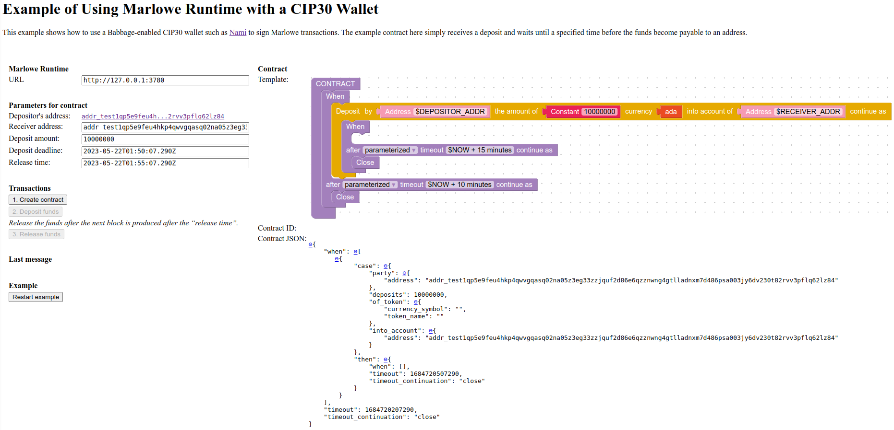

# Example of Using Marlowe Runtime with a CIP30 Wallet

This example shows how to use a Babbage-compatible [CIP30](https://github.com/cardano-foundation/CIPs/tree/master/CIP-0030) wallet such as [Nami](https://namiwallet.io/) to sign Marlowe transactions. The example contract here simply receives a deposit and waits until a specified time before the funds become payable to an address.

[This video](https://youtu.be/EsILiHiNZWk) shows the application in action.

## Source files

- [index.html](index.html): The HTML page for the application.
- [view.css](view.css): The CSS styling for the application
- [src/controller.js](src/controller.js): The JavaScript source code for the application.

## Running the application

- If you have Nix installed, simply execute [./run.sh](run.sh).
- Alternatively, if you have NodeJS installed, execute `npx webpack-dev-server`.

The application is served from [http://127.0.0.1:3000](http://127.0.0.1:3000). It requires the following:

- [Nami](https://namiwallet.io/) wallet is installed in the web browser.
- Nami is connected to an address with at least 100 ada on the Cardano preproduction network.
